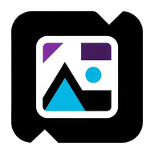

<p align="center">
  
</p>

<h1 align="center">Annotix</h1>

<p align="center">
  <strong>Open-source desktop platform for ML dataset annotation, training, and collaboration</strong><br/>
  Images &middot; Video &middot; Time Series &middot; Tabular Data
</p>

<p align="center">
  <a href="https://github.com/Debaq/Annotix/releases/latest"></a>
  <a href="https://github.com/Debaq/Annotix/releases"></a>
  <a href="https://github.com/Debaq/Annotix/stargazers"></a>
  <a href="https://github.com/Debaq/Annotix/blob/main/LICENSE"></a>
  
</p>

<p align="center">
  
  
  
  
  
</p>

<p align="center">
  <a href="https://github.com/Debaq/Annotix/releases/latest"><strong>Download</strong></a> &nbsp;&bull;&nbsp;
  <a href="https://www.preprints.org/manuscript/202604.0919"><strong>Read the Paper</strong></a> &nbsp;&bull;&nbsp;
  <a href="#getting-started"><strong>Build from Source</strong></a> &nbsp;&bull;&nbsp;
  <a href="#citation"><strong>Cite</strong></a>
</p>

---

## Paper

> **Annotix: An Open-Source Desktop Platform for Comprehensive Machine Learning Dataset Annotation**
>
> Published on [Preprints.org](https://www.preprints.org/manuscript/202604.0919) (April 2026)
>
> Universidad Austral de Chile, Campus Puerto Montt &mdash; [TecMedHub](https://github.com/tecmedhub)

If you use Annotix in your research, please [cite the paper](#citation).

---

## Why Annotix?

Most annotation tools focus on a single data type or require cloud accounts. Annotix is different:

| | Annotix | Cloud tools (CVAT, Label Studio) | Desktop tools (labelImg, LabelMe) |
|---|:---:|:---:|:---:|
| **Runs fully offline** | Yes | No | Yes |
| **Images + Video + Time Series + Tabular** | Yes | Partial | No |
| **Integrated ML training (19 backends)** | Yes | No | No |
| **P2P collaboration (no server)** | Yes | Server required | No |
| **Free GPU training (Colab automation)** | Yes | No | No |
| **Export to 11 formats** | Yes | Yes | Limited |
| **Cross-platform native app** | Yes | Browser | Partial |

---

## Download

Pre-built binaries for the latest release:

| Platform | Download |
|----------|----------|
| **Windows** (x64) | [`.exe` installer](https://github.com/Debaq/Annotix/releases/latest/download/Annotix_2.4.4_x64-setup.exe) &nbsp;\|&nbsp; [`.msi`](https://github.com/Debaq/Annotix/releases/latest/download/Annotix_2.4.4_x64_en-US.msi) |
| **Linux** (x64) | [`.AppImage`](https://github.com/Debaq/Annotix/releases/latest/download/Annotix_2.4.4_amd64.AppImage) |
| **macOS** | Build from source (see [Getting Started](#getting-started)) |

> All releases: [github.com/Debaq/Annotix/releases](https://github.com/Debaq/Annotix/releases)

---

## Features at a Glance

### Annotation Tools

7 tools on a high-performance Konva canvas:

| Tool | Key | Description |
|------|-----|-------------|
| **BBox** | `B` | Rectangular bounding box with drag & resize |
| **OBB** | `O` | Oriented bounding box with free rotation |
| **Mask** | `M` | Freehand painting with configurable brush and eraser |
| **Polygon** | `P` | Point-by-point polygon with auto-close |
| **Keypoints** | `K` | Skeleton presets (COCO, face, hand, MediaPipe) |
| **Landmarks** | `L` | Named reference points with labels |
| **Pan** | `H` | Canvas navigation |

Plus: mouse wheel zoom, image rotation, label/grid toggles, quick class selection (`1`-`0`, `Q`-`P` for up to 20 classes), undo/redo with 100-step history.

### Project Types

- **Images** &mdash; Object detection, oriented detection, semantic/instance segmentation, keypoints, landmarks, single & multi-label classification
- **Video** &mdash; Frame extraction (FFmpeg), tracks with keyframes, linear interpolation, bake to per-frame annotations
- **Time Series** &mdash; Univariate & multivariate CSV, 5 annotation types (point, range, classification, event, anomaly)
- **Tabular** &mdash; Built-in editor with column selection and scikit-learn training

### Integrated ML Training (19 Backends)

Train models directly from the app with real-time metrics charts.

<details>
<summary><strong>Full backend list</strong></summary>

#### Object Detection
| Backend | Models |
|---------|--------|
| **YOLO** (Ultralytics) | YOLOv8, v9, v10, v11, v12 |
| **RT-DETR** (Ultralytics) | RT-DETR-l, RT-DETR-x |
| **RF-DETR** (Roboflow) | RF-DETR-base, RF-DETR-large |
| **MMDetection** (OpenMMLab) | 30+ architectures (Faster R-CNN, DINO, Co-DETR, etc.) |

#### Semantic Segmentation
| Backend | Models |
|---------|--------|
| **SMP** | U-Net, DeepLabV3+, FPN, PSPNet, etc. |
| **HuggingFace Segmentation** | SegFormer, Mask2Former, etc. |
| **MMSegmentation** | Full OpenMMLab catalog |

#### Instance Segmentation
| Backend | Models |
|---------|--------|
| **Detectron2** (Meta) | Mask R-CNN, Cascade R-CNN, etc. |

#### Keypoints & Pose
| Backend | Models |
|---------|--------|
| **MMPose** | HRNet, ViTPose, RTMPose, etc. |

#### Oriented Object Detection (OBB)
| Backend | Models |
|---------|--------|
| **MMRotate** | Oriented R-CNN, RoI Transformer, etc. |

#### Image Classification
| Backend | Models |
|---------|--------|
| **timm** | 700+ models (ResNet, EfficientNet, ViT, ConvNeXt, etc.) |
| **HuggingFace Classification** | ViT, BEiT, DeiT, Swin, etc. |

#### Time Series
| Backend | Task |
|---------|------|
| **tsai** | Classification, regression, forecasting |
| **PyTorch Forecasting** | TFT, N-BEATS, etc. |
| **PyOD** | Anomaly detection |
| **tslearn** | Temporal clustering |
| **PyPOTS** | Missing value imputation |
| **STUMPY** | Matrix Profile (motif/pattern discovery) |

#### Tabular
| Backend | Task |
|---------|------|
| **scikit-learn** | RandomForest, SVM, kNN, GradientBoosting, etc. |

</details>

**4 execution modes:**

| Mode | Description |
|------|-------------|
| **Local** | Isolated Python env via micromamba, GPU auto-detection (CUDA / MPS) |
| **Download Package** | ZIP with script + data for external execution |
| **Cloud** | Vertex AI, Kaggle, Lightning AI, HuggingFace, Saturn Cloud |
| **Browser Automation** | Free T4 GPU on Google Colab via CDP automation |

6 training presets: `small_objects`, `industrial`, `traffic`, `edge_mobile`, `medical`, `aerial`.

Model export: PyTorch `.pt`, ONNX, TorchScript, TFLite, CoreML, TensorRT.

### P2P Collaboration

Real-time collaborative annotation powered by [Iroh](https://iroh.computer/) (QUIC). No central server.

- Host or join with a session code
- Roles: LeadResearcher (full control) / Annotator / DataCurator (configurable permissions)
- Image locking with 3-min TTL, batch assignment, CRDT sync
- Peer list with online status

### Browser Automation

Train on **Google Colab for free** (T4 GPU) via Chrome DevTools Protocol:
- Auto-detects Chromium browsers, uploads dataset, runs training
- Real-time progress with pause / resume / cancel

Query LLMs without API keys through the user's browser: Kimi, Qwen, DeepSeek, HuggingChat.

### Export & Import

**11 export formats:** YOLO Detection, YOLO Segmentation, COCO JSON, Pascal VOC, CSV (Detection/Classification/Keypoints/Landmarks), Folders by Class, U-Net Masks, TIX (native).

**8 import formats** with automatic detection: YOLO, COCO, Pascal VOC, CSV (4 variants), U-Net Masks, Folders by Class, TIX.

### Keyboard Shortcuts

All shortcuts are **fully customizable** from Settings with per-context conflict detection.

<details>
<summary><strong>Default shortcuts</strong></summary>

#### Image Tools
| Shortcut | Action |
|----------|--------|
| `B` | Bounding Box |
| `O` | OBB |
| `M` | Mask |
| `P` | Polygon |
| `K` | Keypoints |
| `L` | Landmarks |
| `H` | Pan |
| `[` / `]` | Decrease / Increase brush size |
| `E` | Toggle eraser |
| `A` / `D` | Rotate image |
| `Enter` | Confirm |
| `Esc` | Cancel |

#### Navigation
| Shortcut | Action |
|----------|--------|
| `Left` / `Right` | Previous / Next image |
| `Ctrl++` / `Ctrl+-` | Zoom in / out |
| `Ctrl+0` | Zoom to fit |

#### General
| Shortcut | Action |
|----------|--------|
| `Ctrl+S` | Save |
| `Ctrl+Z` / `Ctrl+Y` | Undo / Redo |
| `Del` | Delete selection |

#### Quick Class Selection
| Keys | Classes |
|------|---------|
| `1` - `0` | Classes 1 to 10 |
| `Q` - `P` | Classes 11 to 20 |

#### Video
| Shortcut | Action |
|----------|--------|
| `T` | New track |
| `Left` / `Right` | Previous / Next frame |

#### Time Series
| Shortcut | Action |
|----------|--------|
| `V` | Select |
| `P` | Point |
| `R` | Range |
| `E` | Event |
| `A` | Anomaly |

</details>

### Languages

10 languages with lazy loading and English fallback:

`de` Deutsch &middot; `en` English &middot; `es` Espanol &middot; `fr` Francais &middot; `it` Italiano &middot; `ja` Japanese &middot; `ko` Korean &middot; `pt` Portugues &middot; `ru` Russian &middot; `zh` Chinese

---

## Architecture

```
+-----------------------------------------------------+
|                    Frontend                           |
|   React 19 + TypeScript + Tailwind + shadcn/ui       |
|   Konva (canvas) . Chart.js (metrics) . i18next      |
|   Zustand (state) . React Router 7                   |
+-----------------------------------------------------+
|                  Tauri 2 IPC                          |
|             137+ registered commands                  |
+-----------------------------------------------------+
|                  Backend (Rust)                       |
|   +------------+ +-----------+ +-----------------+   |
|   |   Store    | | Commands  | | Export/Import   |   |
|   | (JSON+RAM) | | (16 mod)  | | (11+8 formats) |   |
|   +------------+ +-----------+ +-----------------+   |
|   +------------+ +-----------+ +-----------------+   |
|   |  Training  | | Browser   | | P2P (Iroh)      |   |
|   | (19 backs) | | Automat.  | | QUIC mesh       |   |
|   +------------+ +-----------+ +-----------------+   |
+-----------------------------------------------------+
|               External Integrations                   |
|   Python (micromamba) . FFmpeg . Chromium CDP         |
|   Cloud APIs . Iroh P2P network                      |
+-----------------------------------------------------+
```

### Storage

All data stored as JSON + raw assets on disk. No database.

```
~/.local/share/annotix/config.json        -> global configuration
{projects_dir}/{uuid}/project.json        -> project (metadata + classes + annotations)
{projects_dir}/{uuid}/images/             -> original images
{projects_dir}/{uuid}/thumbnails/         -> generated thumbnails
{projects_dir}/{uuid}/videos/             -> video files
{projects_dir}/{uuid}/models/             -> trained models
```

In-memory cache with dirty-flag tracking, atomic writes (`.tmp` + `rename`).

---

## Tech Stack

<details>
<summary><strong>Frontend</strong></summary>

| Technology | Version | Purpose |
|------------|---------|---------|
| React | 19 | UI framework |
| TypeScript | 5.7 | Static typing |
| Vite | 6 | Bundler and dev server |
| Tailwind CSS | 3.4 | Utility-first styling |
| shadcn/ui | &mdash; | Component library (Radix UI) |
| Zustand | 5 | Global state with persistence |
| React Router | 7 | SPA routing |
| Konva | 10 | 2D annotation canvas |
| Chart.js | 4 | Metrics visualization |
| i18next | 24 | Internationalization |

</details>

<details>
<summary><strong>Backend (Rust)</strong></summary>

| Crate | Version | Purpose |
|-------|---------|---------|
| tauri | 2 | Desktop application framework |
| serde / serde_json | 1 | JSON serialization |
| image | 0.25 | Image processing |
| ffmpeg-the-third | 4 | Video frame extraction |
| zip | 2 | Export/import packaging |
| quick-xml | 0.37 | Pascal VOC XML |
| csv | 1.3 | CSV import/export |
| reqwest | 0.12 | HTTP client (cloud providers) |
| headless_chrome | 1.0 | Browser automation (CDP) |
| iroh | 0.96 | P2P networking (QUIC) |
| tokio | 1 | Async runtime |
| blake3 | 1 | Hashing |

</details>

<details>
<summary><strong>Python (via micromamba)</strong></summary>

| Package | Purpose |
|---------|---------|
| ultralytics | YOLO, RT-DETR |
| rfdetr | RF-DETR |
| mmdet, mmseg, mmpose, mmrotate | OpenMMLab suite |
| segmentation-models-pytorch | Semantic segmentation |
| timm | Classification (700+ models) |
| detectron2 | Instance segmentation |
| tsai, pytorch-forecasting | Time series deep learning |
| pyod, tslearn, pypots, stumpy | Time series classical ML |
| scikit-learn | Tabular ML |

</details>

---

## System Requirements

- **OS**: Windows 10+, macOS 12+, Linux (glibc 2.31+)
- **RAM**: 4 GB minimum, 8 GB recommended
- **Disk**: ~500 MB for the app + space for datasets
- **GPU** (optional): NVIDIA with CUDA or Apple Silicon with MPS for accelerated training
- **FFmpeg**: required for video annotation (bundled in release builds)
- **Chromium browser** (optional): for browser automation (Chrome, Brave, Edge)

---

## Getting Started

### Prerequisites

- [Node.js](https://nodejs.org/) >= 18
- [Rust](https://rustup.rs/) >= 1.89
- [Tauri 2 prerequisites](https://v2.tauri.app/start/prerequisites/) for your platform

### Build & Run

```bash
git clone https://github.com/Debaq/Annotix.git
cd Annotix
npm install
npm run tauri:dev       # development (hot-reload)
npm run tauri:build     # production build
```

### Scripts

| Script | Description |
|--------|-------------|
| `npm run dev` | Frontend only (Vite dev server) |
| `npm run build` | Build frontend (TypeScript check + Vite) |
| `npm run tauri:dev` | Full dev (frontend + Rust backend) |
| `npm run tauri:build` | Production build with installers |
| `npm run lint` | ESLint with zero warnings policy |

---

## Project Structure

```
annotix/
├── src/                         # React frontend
│   ├── App.tsx                  # Router and providers
│   ├── lib/
│   │   ├── db.ts                # Type definitions (mirrors Rust structs)
│   │   ├── tauriDb.ts           # Centralized Tauri invoke bridge
│   │   └── i18n.ts              # i18next configuration
│   ├── components/ui/           # shadcn/ui components
│   └── features/
│       ├── canvas/              # Annotation canvas (7 tools)
│       ├── video/               # Video annotation
│       ├── timeseries/          # Time series annotation
│       ├── tabular/             # Tabular data editor
│       ├── training/            # ML training panel
│       ├── export/              # 11 export formats
│       ├── import/              # 8 import formats
│       ├── inference/           # Model inference
│       ├── p2p/                 # P2P collaboration
│       ├── browser-automation/  # Chrome automation
│       └── settings/            # App settings
├── src-tauri/                   # Rust backend
│   └── src/
│       ├── lib.rs               # 137+ Tauri command registrations
│       ├── store/               # Storage layer (state, IO, cache)
│       ├── commands/            # 16 command modules
│       ├── export/              # Export format modules
│       ├── import/              # Import + auto-detector
│       ├── training/            # Multi-backend ML pipeline
│       ├── browser_automation/  # Headless Chrome
│       ├── p2p/                 # Iroh P2P networking
│       └── inference/           # ONNX inference
└── public/locales/              # 10 language files
```

---

## Citation

If you use Annotix in your research, please cite:

```bibtex
@article{annotix2026,
  title     = {Annotix: An Open-Source Desktop Platform for Comprehensive Machine Learning Dataset Annotation},
  year      = {2026},
  publisher = {Preprints.org},
  url       = {https://www.preprints.org/manuscript/202604.0919}
}
```

> Full paper: [https://www.preprints.org/manuscript/202604.0919](https://www.preprints.org/manuscript/202604.0919)

---

## Contributing

Contributions are welcome. Please open an issue first to discuss what you'd like to change.

---

## License

MIT License &mdash; [TecMedHub](https://github.com/tecmedhub), Universidad Austral de Chile, Campus Puerto Montt.
