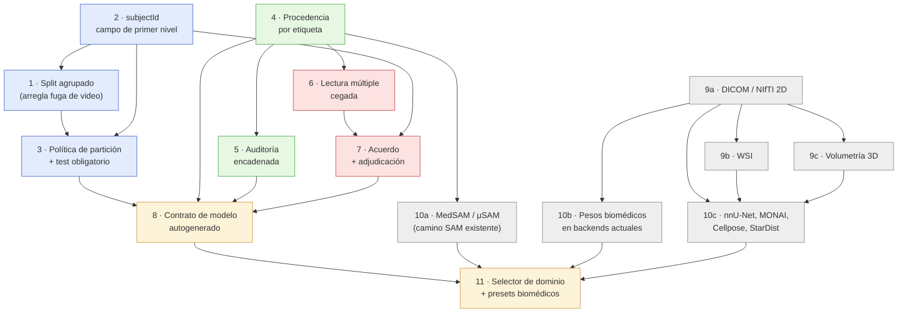

# Fase 2 — Roadmap de biomedicalización

> Entrega de la **Fase 2** del prompt `docs/prompt-annotix-biomedico.md`.
> Se apoya en el diagnóstico de `docs/biomedico-fase1-auditoria.md`.
> Las etapas están ordenadas **por dependencia técnica y relación
> valor/esfuerzo**, no por fecha. No se implementó código.

---

## Criterio de ordenamiento

Tres reglas decidieron el orden:

1. **Primero lo que arregla un defecto ya presente.** La etapa 1 no agrega
   funcionalidad biomédica: corrige una fuga de datos que hoy contamina
   cualquier proyecto de video (`training/dataset.rs` no conoce `videoId`). Es
   la intervención más barata del roadmap y la de mayor efecto sobre la validez
   de todo lo que el sistema ya entrena.
2. **Lo barato que otros necesitan, antes que lo caro que nadie bloquea.** El
   identificador de sujeto es un campo opcional más una migración; el módulo de
   adjudicación es un subsistema. El campo va primero porque las etapas 3, 7, 8
   y 11 lo exigen.
3. **Los cambios de esquema, agrupados y lo más temprano posible.** Cada
   migración de `project.json` tiene un costo fijo (versión nueva, migración en
   `store/io.rs:112`, compatibilidad P2P entre pares con versiones distintas).
   Conviene pagarlo pocas veces y pronto, no repartido a lo largo del año.

La ingesta médica (etapa 9) es **independiente** de la cadena de los pilares:
puede avanzar en paralelo desde el día uno con otra persona, y solo se reencuentra
con el resto en la etapa 11.

---

## Etapa 1 — Split agrupado por unidad natural ✅ **hecho**

**Qué se construye.** `split_plan` (`training/dataset.rs:155-176`) deja de
barajar índices de imagen y pasa a barajar **grupos**. La clave de grupo se
resuelve por cascada: `subjectId` si existe (etapa 2) → `videoId` → el propio
`image.id`. Se conserva la semilla derivada de `project.id`, así que el reparto
sigue siendo determinista y reproducible. `compute_split` pasa a trabajar sobre
conteo de grupos con reequilibrio por tamaño, porque los grupos son desiguales
(un video de 300 fotogramas junto a imágenes sueltas). Se persiste en
`TrainingJobEntry` la composición real: grupos e ítems por partición.

**Qué pilar cierra.** Pilar 2, primera mitad: partición sin fuga. Deja el
enganche listo para que el sujeto entre sin volver a tocar el repartidor.

**Tipos de proyecto afectados.** Todos los entrenables (19). El efecto real
aparece hoy en los que tienen video consolidado: `bbox`, `obb`, `mask`,
`polygon`, `instance-segmentation`, `keypoints`, `landmarks`.

**Qué validar con datos reales.** Un proyecto con ≥3 videos consolidados: que
la intersección de `videoId` entre train, val y test sea vacía. Reentrenar el
mismo proyecto antes y después y comparar mAP: **se espera que baje**. Si no
baja, o el proyecto no tenía fuga, o el agrupamiento no se aplicó — hay que
distinguir los dos casos antes de dar la etapa por cerrada. Verificar también
que un proyecto de imágenes sueltas da exactamente el mismo reparto que antes
(sin regresión de reproducibilidad).

---

## Etapa 2 — Identificador de sujeto como campo de primer nivel

**Qué se construye.** `subjectId: Option<String>` en `ImageEntry`,
`VideoEntry`, `TimeSeriesEntry` y `TabularDataEntry`
(`store/project_file.rs`); `AudioEntry.speaker_id` se mantiene y se alinea
semánticamente. Formato `project.json` v4 con migración en
`store/io.rs:migrate_project` (los proyectos existentes quedan con `None`, sin
reescritura de datos). UI: columna y filtro de sujeto en la galería, asignación
masiva por selección, y tres vías de carga — manual, extracción por patrón
desde el nombre de archivo (`P0031_ax_012.jpg` → `P0031`), e importación desde
CSV de mapeo. Sincronización P2P del campo en `images/{id}/meta`.

Deliberadamente **opcional** en esta etapa: un proyecto generalista nunca lo ve.

**Qué pilar cierra.** Pilar 2, segunda mitad. Es también precondición de los
pilares 1 y 4 (no se puede describir la población ni estratificar la
adjudicación sin saber a quién pertenece cada muestra).

**Tipos de proyecto afectados.** Los 19 implementados. Los 4 de audio heredan el
concepto vía `speakerId`.

**Qué validar con datos reales.** Un corpus real con sujetos repetidos (varios
cortes o visitas del mismo paciente): que la extracción por patrón acierte en
≥95 % de los archivos y que los fallos sean visibles y corregibles, no
silenciosos. Que un proyecto abierto con la versión anterior y migrado no pierda
ni una anotación. Que dos pares P2P con versiones distintas de la app no se
corrompan al sincronizar.

---

## Etapa 3 — Política de partición declarada y test obligatorio

**Qué se construye.** Un bloque de política de partición a nivel de proyecto:
unidad de agrupación (ítem / video / sujeto), fracciones, semilla, y si el test
es obligatorio. En dominio biomédico (etapa 11) el valor **recomendado** de
`testSplit` deja de ser 0 — hoy lo es por defecto
(`presets.ts → getDefaultConfig`) — pero sigue siendo elegible: entrenar sin
test queda permitido y anotado, no impedido. Se persiste un
**reporte de composición**: nº de sujetos, ítems y anotaciones por clase en cada
partición, más la advertencia cuando una clase no aparece en test. Ese reporte
es el primer insumo que el contrato de modelo consumirá sin trabajo manual.

**Qué pilar cierra.** Cierra el pilar 2 y entrega la primera pieza del pilar 4.

**Tipos de proyecto afectados.** Todos los entrenables.

**Qué validar con datos reales.** Un corpus con clase rara (prevalencia <2 %):
que el sistema avise de que la clase no está representada en test en vez de
entrenar callando. Que el reporte de composición coincida con el contenido real
de los directorios preparados en disco (contarlos, no confiar en el plan).

---

## Etapa 4 — Procedencia por etiqueta, generalizada

**Qué se construye.** `AnnotationEntry` (`store/project_file.rs:139-172`) suma:
`createdAt`, `updatedAt`, `author`, `origin` (`manual` | `model` | `track` |
`import` | `adjudicated`), `modelId`, y un estado de revisión
(`unreviewed` | `reviewed` | `corrected` | `accepted` | `rejected`) con
`reviewedBy`/`reviewedAt`. El mismo bloque se replica en `TsAnnotationEntry`,
`AudioSegment` y `AudioEvent`, que hoy no tienen ninguno. En video, "revisada"
pasa de memoria de sesión (`src/features/study/videoStudy.ts:26-90`) a campo
persistido en `KeyframeEntry`, junto a `isKeyframe` (fijada) y la interpolación
ya existente.

Dos correcciones de comportamiento, no solo de esquema:

- `store/inference.rs:337` deja de reescribir la predicción aceptada como
  `source: "user"`: conserva `origin: "model"` + `modelId`, y marca
  `accepted` o `corrected` según si la geometría cambió.
- Las predicciones resueltas dejan de borrarse (`inference.rs:350`): pasan a un
  historial, porque el rechazo es tan informativo como la aceptación.

Además, los exportadores emiten la procedencia donde el formato lo permite:
COCO como campos extra por anotación, `.tix` completo, y un CSV lateral de
procedencia para YOLO y Pascal VOC, que no tienen dónde alojarla.

**Qué pilar cierra.** Pilar 3 completo, salvo la parte multievaluador que
depende de la etapa 6.

**Tipos de proyecto afectados.** Los 19; el impacto mayor está en los que usan
asistencia de modelo (SAM, inferencia) y en video.

**Qué validar con datos reales.** Una sesión real de pre-anotación con modelo
sobre ≥200 imágenes: que al final se pueda responder con el dato, no con la
memoria, qué fracción de etiquetas fue trazada a mano, aceptada sin cambios,
corregida y rechazada. Reexportar a COCO y comprobar que la procedencia
sobrevive el viaje de ida y vuelta.

---

## Etapa 5 — Registro de auditoría encadenado por proyecto

**Qué se construye.** Un `audit.jsonl` dentro del directorio del proyecto que
registra cada cambio con efecto sobre el ground truth: creación, edición y
borrado de etiquetas, aceptación de predicciones, consolidación de tracks,
cambios de clases, importaciones, entrenamientos y exportaciones. Reutiliza
literalmente la maquinaria del modo estudio (`study/log.rs`): solo-anexado,
`prev_hash` = SHA-256 de la línea previa, verificador (`study/verify.rs`),
recuperación de sesiones muertas, y el test normativo que falla si el código
emite un evento no documentado.

Diferencia de contrato respecto del modo estudio, y es el punto delicado: el
modo estudio es **anónimo por diseño** — rechaza rutas, nombres y texto de más
de 128 caracteres. El registro de auditoría necesita exactamente lo contrario
(ids en claro, autoría). Son dos subsistemas con la misma mecánica y políticas
de privacidad opuestas: deben quedar separados, con nombres que no se confundan,
y el de auditoría debe ser explícito en la UI sobre qué guarda.

**Qué pilar cierra.** Da integridad verificable a los pilares 3 y 4.

**Tipos de proyecto afectados.** Todos.

**Qué validar con datos reales.** Matar el proceso a mitad de una sesión de
anotación y comprobar que la cadena se recupera y verifica. Alterar una línea
del archivo a mano y comprobar que el verificador lo detecta. Medir el costo en
una sesión intensa (≥2000 anotaciones): si la escritura encadenada degrada el
canvas, la etapa no está cerrada.

---

## Etapa 6 — Lectura múltiple: una capa de etiquetas por evaluador

**Qué se construye.** El cambio estructural del roadmap. `ImageEntry.annotations`
deja de ser la única verdad y pasa a ser la **capa consolidada**; aparece
`readings: [{ authorId, annotations[], submittedAt, status }]` con una capa por
evaluador. Reglas de sesión (`p2p/mod.rs:96-121`) suman `replication: n`
(cuántas lecturas independientes por muestra) y `blind: bool`.

Tres subsistemas cambian de comportamiento:

- `p2p/locks.rs`: el lock pasa a ser por **(imagen, evaluador)**. Hoy excluye la
  doble lectura, que es justo lo que se quiere permitir.
- `p2p/distribution.rs`: `distribute_work` asigna cada ítem a `n` pares
  distintos en vez de a uno, balanceando sin que un mismo par reciba el ítem dos
  veces.
- `p2p/sync.rs`: la lectura deja de colapsar. El sustrato ya guarda una entrada
  por autor (`doc.set_bytes(session.author_id, "images/{id}/annots", …)`,
  l. 1397); lo que hay que cambiar es `doc_to_project_metadata`
  (l. 479-500), donde el `HashMap<img_id, HashMap<field, bytes>>` hace que gane
  la última entrada del stream. En modo cegado, además, el watcher no debe
  entregar a un par las capas de los demás.

**Qué pilar cierra.** Pilar 1, primera mitad: la lectura múltiple cegada.

**Tipos de proyecto afectados.** Todos los que se anotan colaborativamente:
imagen (9), series temporales (9) y video. Tabular queda fuera del alcance
inicial.

**Qué validar con datos reales.** Una sesión con tres anotadores reales sobre el
mismo corpus, en modo cegado: que ninguno vea las capas de los otros ni en la
UI ni en el `project.json` local, que las tres capas lleguen completas al host, y
que un par que se cae y vuelve no pierda ni duplique su capa. Probar el caso
feo: el host abre el proyecto mientras los tres anotan.

---

## Etapa 7 — Acuerdo entre evaluadores y adjudicación

**Qué se construye.** Sobre las capas de la etapa 6:

- **Cálculo de acuerdo**, por tipo de anotación: κ de Cohen (dos evaluadores) y
  κ de Fleiss (tres o más) para `classification`, `multi-label-classification` y
  clases de series temporales; Dice e IoU pareados para `mask`, `polygon` e
  `instance-segmentation`; IoU para `bbox` y `obb`; límites de acuerdo de
  Bland-Altman para medidas continuas — distancias entre `landmarks`, conteos,
  regresión de series. Todo con intervalo de confianza.
- **Cola de discrepancias**, ordenada por desacuerdo, con el caso peor arriba.
- **Rol adjudicador**: `PeerRole` suma el rol; la resolución escribe la capa
  consolidada con `origin: "adjudicated"` y deja en el registro de auditoría
  quién decidió y sobre qué capas.
- **Reporte de acuerdo del corpus**, persistido a nivel de proyecto y
  recalculado al cambiar las capas. Es la precondición que la etapa 11 exigirá
  a los presets biomédicos.

**Qué pilar cierra.** Pilar 1 completo.

**Tipos de proyecto afectados.** Los mismos de la etapa 6. El cálculo es
específico por tipo de anotación: cada familia necesita su métrica, y esa es la
mayor parte del trabajo.

**Qué validar con datos reales.** Un corpus doblemente leído por dos personas
reales del dominio: comparar el κ calculado contra el mismo cálculo hecho fuera
(R/scipy) sobre los datos exportados — si no coinciden al tercer decimal, hay un
error de implementación. Comprobar que la cola de discrepancias pone arriba los
casos que los evaluadores efectivamente reconocen como difíciles; si ordena
ruido, la métrica de desacuerdo elegida es la equivocada.

---

## Etapa 8 — Contrato de modelo autogenerado

**Qué se construye.** Un `model_contract.json` junto al modelo, y su
representación en el informe PDF
(`src/features/training/services/trainingReportService.ts`), armado sin
intervención del usuario a partir de lo que las etapas anteriores dejaron en el
dato:

| Sección | De dónde sale |
|---|---|
| Población de entrenamiento: nº de sujetos, ítems y clases por partición | Etapa 3 (reporte de composición) |
| Criterios de inclusión/exclusión | Declarados una vez a nivel de proyecto; el contrato los transcribe |
| Procedencia del ground truth: % manual / modelo aceptado / corregido / adjudicado | Etapa 4 |
| Acuerdo entre evaluadores con IC | Etapa 7 |
| Métricas sobre test independiente, con intervalos de confianza | Etapa 3 + bootstrap **agrupado por sujeto** sobre el test |
| Versión del pipeline: app, backend, dependencias del entorno Python | `training/package.rs`, `python_env.rs` |
| Límites de uso previsto | Plantilla derivada de modalidad y población; el usuario la revisa, no la redacta |
| Integridad | Hash del modelo, del dataset y del tramo de auditoría (etapa 5) |

Detalle que decide la validez del número: los intervalos de confianza deben
salir de un bootstrap **por sujeto**, no por imagen. Remuestrear imágenes de los
mismos 12 pacientes produce intervalos artificialmente estrechos y es el error
estadístico más común en este tipo de informe.

**Qué pilar cierra.** Pilar 4.

**Tipos de proyecto afectados.** Todos los entrenables.

**Qué validar con datos reales.** Un entrenamiento real de punta a punta:
que cada campo del contrato sea rastreable a un dato del proyecto, sin ningún
valor inventado ni marcador de relleno. Que el mismo proyecto entrenado dos
veces produzca el mismo contrato salvo métricas. Que un revisor externo pueda
verificar los hashes con las herramientas que el propio sistema expone.

---

## Etapa 9 — Ingesta de imagen médica (independiente, paralelizable)

Tres sub-etapas de costo muy distinto. **Ninguna cierra un pilar**: desbloquean
modalidades, y sin ellas buena parte del catálogo de la Fase 3 es inalcanzable.

> **Corrección al plan (2026-09-13).** Esta etapa **no** es precondición de todo
> lo biomédico, como se leía más arriba. Una tesela de histopatología, una foto de
> fondo de ojo y una radiografía exportada a PNG son imágenes 2D normales: entran
> por el camino que ya existe. Sólo la **volumetría** (9c) y la **lectura de
> lámina completa** (9b) dependen de verdad de esta etapa. Por eso la 10b pudo
> empezar antes que la 9.

**9a — DICOM y NIfTI 2D.** Lectura de DICOM (corte único y series) y NIfTI con
extracción de cortes, metadatos de adquisición (modalidad, equipo, kVp/TE/TR,
espaciado de píxel), ventaneo window/level en el canvas, y **deidentificación al
importar** con reporte de qué campos se eliminaron. El `subjectId` de la etapa 2
puede poblarse desde `PatientID` — con la advertencia de que un `PatientID` en
claro es un identificador directo y la deidentificación debe seudonimizarlo, no
copiarlo. Habilita CT, MRI y rayos X, y con ello los presets de tórax y el punto
de partida de segmentación anatómica 2D.

**9b — Whole-slide imaging.** Lectura piramidal, navegación por teselas,
anotación sobre teselas con coordenadas en el marco de la lámina completa, y
entrenamiento por teselas con agrupación por lámina (que el split de la etapa 1
ya sabría respetar). Habilita histopatología: HIPT, CTransPath, UNI. Es una
etapa cara y bastante autónoma respecto del resto.

**9c — Volumetría 3D.** Eje Z en el esquema (`ImageEntry` es 2D puro),
espaciado de vóxel, anotación y propagación entre cortes, métricas volumétricas.
Habilita nnU-Net 3D y la mayor parte de MONAI. Es la etapa más cara del roadmap
y toca canvas, esquema, exportación y entrenamiento a la vez: conviene
declararla explícitamente fuera del alcance inicial y decidirla con evidencia de
demanda.

**Qué validar con datos reales.** Series DICOM reales de al menos dos fabricantes
distintos: que se lean sin pérdida, que el ventaneo reproduzca lo que muestra un
visor clínico de referencia, y que la deidentificación no deje ningún
identificador — verificado con una herramienta externa, no con la propia.

---

## Etapa 10 — Backends y pesos biomédicos

Tres niveles, otra vez de costo creciente:

**10a — Asistencia de segmentación (barato).** MedSAM y μSAM entran por el
camino SAM ya construido: encoder + decoder ONNX en
`{data_dir}/sam_models/`, AMG y refinamiento por clicks
(`inference/sam/amg.rs`, `docs/roadmap_sam.md`). Es cambio de pesos, no de
arquitectura. Combinado con la etapa 4, cada máscara aceptada queda marcada como
sugerida por modelo y revisada por humano.

**10b — Pesos biomédicos sobre backends existentes (medio). 🟡 empezado.**
Ya entraron cinco por catálogo, sin tocar generadores: RadioDINO S/16 y B/16
(RadImageNet), Lunit DINO y Owkin Phikon (histopatología), y RAD-DINO (radiografía
de tórax). Queda lo que exige token del Hub —UNI, RETFound— y lo que exige
`trust_remote_code`.
 RadImageNet,
BiomedCLIP, UNI, CTransPath, RETFound y TorchXRayVision como **inicialización**
en los backends `timm`, `hf_classification` y `smp`, en lugar de ImageNet. No
requiere backend nuevo: requiere resolución de pesos, caché local, y declarar la
licencia y la vía de acceso de cada uno (varios exigen solicitud y aceptación de
términos, lo que rompe la descarga automática silenciosa y debe resolverse en la
UI, no con un error de red).

**10c — Backends nuevos (caro).** nnU-Net, MONAI, Cellpose/CellposeSAM y
StarDist como backends propios, cada uno con su entrada en `TrainingBackend`
(`training/mod.rs:364`), su preparador declarando rutas por el contrato
`training/contract.rs`, su generador de script y su smoke test en CPU real
(`scripts/train_smoke.sh`). nnU-Net además autoconfigura y no acepta el
`epochs`/`batch` habitual: su preset expone otros controles. Este es el camino
que ya se recorrió con los 16 backends verificados; la disciplina de
`PreparedDataset` existe justamente para que no se repita el desastre de
`docs/roadmap_train.md`.

**Qué validar con datos reales.** Para cada backend nuevo, un entrenamiento real
en CPU de punta a punta con un corpus mínimo — no un `--help` ni un import. Para
los pesos biomédicos, comparar contra la línea base ImageNet en el mismo corpus
pequeño: si el backbone biomédico no gana con poco dato, no merece el preset que
lo recomienda.

---

## Etapa 11 — Selector de dominio y presets biomédicos

**Qué se construye.** El diseño completo es la Fase 3. En términos de
dependencia: un primer paso "tipo de dominio" (general / biomédico) que filtra
modelos y presets, la familia generalista intacta (los 6 `SCENARIO_PRESETS`
actuales), la familia biomédica construida sobre las etapas 9 y 10, y las
**validaciones previas no bloqueantes**: sin `subjectId` cargado (etapa 2), sin
split agrupado (etapa 1), sin test (etapa 3) o sin reporte de acuerdo (etapa 7),
el preset se lanza igual y lo que baja es el **nivel de evidencia** que declara
el contrato. El costo de no cumplir cae en el documento, no en el flujo de
trabajo del usuario. Al terminar, el contrato de la etapa 8 se emite solo.

**Qué pilar cierra.** Ninguno nuevo: es la superficie donde los cuatro se
vuelven visibles y exigibles para el usuario.

**Tipos de proyecto afectados.** Todos, aunque el generalista solo nota que
apareció un paso más al inicio.

**Qué validar con datos reales.** Que un usuario generalista complete un
entrenamiento sin encontrarse con un solo término clínico. Que un usuario biomédico
con el corpus a medio preparar pueda entrenar igual, y que el contrato
resultante diga sin ambigüedad qué no se pudo declarar y por qué eso limita el
uso del modelo.

---

## Puntos de no retorno

Cambios que, una vez hechos, no se revierten sin migración o sin romper
proyectos existentes. Cada uno merece decisión explícita antes de escribirse.

| # | Cambio | Etapa | Por qué no tiene vuelta atrás |
|---|---|---|---|
| 1 | `subjectId` en cuatro entidades; `project.json` v4 | 2 | El campo es opcional y así se queda: ninguna etapa lo vuelve obligatorio. Lo irreversible es otra cosa — cómo se **seudonimiza**. Un `PatientID` en claro copiado a mil proyectos no se recoge, y el esquema de seudonimización debe decidirse antes de la primera importación, no después. |
| 2 | Split agrupado por defecto | 1 | Cambia las métricas de todo proyecto de video ya entrenado. Los números históricos dejan de ser comparables con los nuevos, y los anteriores eran optimistas. Hay que decir esto en el informe, no dejarlo implícito. |
| 3 | Bloque de procedencia en cuatro tipos de anotación | 4 | Migración de esquema. Los datos viejos quedan con procedencia desconocida para siempre: no hay forma de reconstruir quién anotó qué antes de que el campo existiera. Cuanto más tarde, más corpus nace ciego. |
| 4 | Predicciones aceptadas dejan de ser `source: "user"` | 4 | Cambia la semántica de un campo ya escrito en disco. Las etiquetas existentes con `source: "user"` son ambiguas — mezcla de manuales y de aceptadas — y quedarán ambiguas. La migración puede marcarlas `origin: "unknown"`, nunca adivinar. |
| 5 | `annotations` → capas por evaluador | 6 | El más profundo. Toca `project.json`, el protocolo P2P, los locks, la distribución y toda lectura de anotaciones de la app. Un par con versión anterior no entiende el proyecto. Exige versión de protocolo y negociación de compatibilidad, o una regla explícita de "todos actualizan". |
| 6 | Cadena de hash del registro de auditoría | 5 | Una vez encadenado, cualquier migración futura que reescriba datos históricos rompe la verificación. Toda migración posterior debe re-anclar la cadena y dejar constancia de haberlo hecho, o el archivo pasa a reportar manipulación donde solo hubo mantenimiento. |
| 7 | SAM3: AMG → predicción directa estilo DETR | 10a | No es cambio de pesos, es otro camino de inferencia. El pipeline actual (encode → grilla de puntos → decoder batched → NMS) no se adapta: se sustituye. Los sliders de granularidad/score/NMS de la UI pierden sentido. Convivir con ambos significa mantener dos caminos. |
| 8 | Eje Z en `ImageEntry` | 9c | Convierte la unidad de anotación de imagen en volumen. Afecta canvas, esquema, exportación, entrenamiento y todo formato de export 2D existente. Es el cambio que más conviene no hacer hasta tener demanda demostrada. |
| 9 | Retirada de un backend biomédico ya publicado | 10c | Mismo aprendizaje de OpenMMLab/Detectron2 (`docs/roadmap_train.md`): un backend que no entrena de verdad cuesta más retirarlo que no haberlo agregado. Ninguno se publica sin smoke test en CPU real. |

---

## Diagrama de dependencias

Leyendo el grafo: hay **dos cadenas independientes** que solo se juntan al
final. La cadena de validez (1→2→3→4→5→6→7→8) es la que convierte a Annotix en
una plataforma de patrones de referencia; la cadena de modalidad
(9→10) es la que la convierte en biomédica. Se pueden llevar en paralelo, y si
hubiera que elegir una sola, la primera es la que el producto no puede comprar
hecha en ningún otro lado.

---

## Nota sobre la etapa 1 como "quick win"

La etapa 1 no necesita nada de este roadmap para ejecutarse: `videoId` ya existe
en `ImageEntry`. Se puede hacer esta semana, mejora la validez de todo proyecto
de video existente, y su único costo real es que los números de los
entrenamientos anteriores dejan de ser comparables — que es precisamente el
hallazgo, no el daño.
