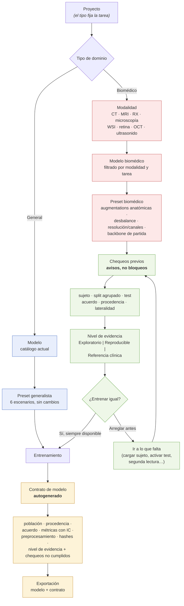

# Fase 3 — Presets de entrenamiento: biomédicos y generalistas conviviendo

> Entrega de la **Fase 3** del prompt `docs/prompt-annotix-biomedico.md`.
> Se apoya en `docs/biomedico-fase1-auditoria.md` (diagnóstico) y
> `docs/biomedico-fase2-roadmap.md` (dependencias). No se implementó código.

---

## Dos decisiones que se apartan del prompt original

**1. Las validaciones previas no bloquean el entrenamiento.** El prompt pedía
que un preset biomédico "no se habilite" si falta el identificador de sujeto o
el reporte de acuerdo. Se descarta: **las mejoras son opcionales, no
bloqueantes**. Un flujo que impide entrenar hasta tener el corpus perfecto
convierte cada mejora en un peaje, y el usuario que solo quiere probar una idea
se va a otra herramienta.

El mecanismo que las reemplaza hace el mismo trabajo sin cobrar peaje: cada
chequeo que no se cumple **baja el nivel de evidencia que declara el contrato de
modelo**. Se entrena siempre; lo que cambia es lo que el documento puede afirmar
del modelo resultante. El costo de no cumplir cae en el papel, no en el flujo de
trabajo — que es exactamente donde debe caer, porque el papel es el que viaja
fuera del laboratorio.

**2. Se agrega la familia U-Net al catálogo.** No estaba en la lista de
referencia del prompt y es la familia más usada en segmentación biomédica. Es
además el preset más barato del roadmap: **U-Net clásico y U-Net++ ya están
implementados** en el backend `smp` (`training/backends.rs:467-486`:
`Unet-resnet34`, `UnetPlusPlus-resnet50`). Solo falta Attention U-Net, que en
`segmentation_models_pytorch` es `Unet` con `decoder_attention_type="scse"` — un
parámetro que hoy el generador no pasa (`training/scripts.rs:1754-1761`).

---

## 1. Niveles de evidencia (lo que reemplaza a las validaciones bloqueantes)

Tres niveles, calculados solos a partir del estado del proyecto en el momento de
lanzar. Se muestran antes de entrenar —con lo que falta para subir de nivel y un
enlace a dónde arreglarlo— y se estampan en el contrato de modelo.

| Nivel | Qué se cumple | Qué puede afirmar el contrato |
|---|---|---|
| **Exploratorio** | Nada en particular. Es el nivel de partida y el de todo proyecto generalista. | "Métricas internas sobre una partición aleatoria. No apto para estimar desempeño en población nueva." |
| **Reproducible** | Split agrupado por sujeto o unidad natural (etapa 1-2) · conjunto de test presente (etapa 3) · procedencia completa de las etiquetas (etapa 4) | "Desempeño estimado sobre sujetos no vistos, con intervalos de confianza y procedencia trazable del ground truth." |
| **Referencia clínica** | Todo lo anterior · lectura múltiple con acuerdo medido (etapas 6-7) · población y criterios de inclusión/exclusión declarados · registro de auditoría íntegro (etapa 5) | "Ground truth construido por lectura múltiple con acuerdo reportado, sobre una población descrita, con cadena de auditoría verificable." |

Chequeos individuales que alimentan el nivel — cada uno es un aviso, nunca un
bloqueo:

| Chequeo | Si falta, el contrato dice |
|---|---|
| `subjectId` cargado en las muestras | "Población no declarada: no se conoce el número de sujetos ni su reparto entre particiones." |
| Split agrupado por sujeto | "Muestras del mismo sujeto pueden estar en train y test: las métricas son probablemente optimistas." |
| `testSplit > 0` | "Sin conjunto de test independiente: las métricas reportadas son de validación y están sesgadas por la selección del mejor epoch." |
| Reporte de acuerdo entre evaluadores | "Ground truth de lectura única: la variabilidad entre observadores no fue medida." |
| Procedencia completa | "Origen desconocido para N % de las etiquetas (anotadas antes de que el sistema lo registrara)." |
| Criterios de inclusión/exclusión declarados | "Criterios de inclusión no declarados." |
| Modalidad declarada | "Modalidad no declarada: no se puede verificar que el preprocesamiento corresponda a la modalidad del corpus." |

Un caso merece trato aparte porque no es de evidencia sino de corrección: si el
corpus está marcado como modalidad lateralizada (rayos X, corte axial,
mamografía) y el preset activa volteo horizontal, el aviso es de **error de
configuración**, no de evidencia. Sigue sin bloquear, pero se dice con otras
palabras: no es que el modelo esté peor documentado, es que probablemente está
mal entrenado.

---

## 2. Selector de dominio

Un paso previo, **general / biomédico**, que filtra modelos y presets. El
generalista no ve un solo término clínico; el biomédico gana un paso más
(modalidad) que es el que permite que el preset sepa qué preprocesamiento y qué
augmentations tienen sentido.

El dominio se guarda en el proyecto, se pregunta una vez y se puede cambiar.
La tarea no se pregunta: la sigue derivando el tipo de proyecto
(`projectTypeToTask`, `utils/modelMapping.ts:2-23`), como hoy.

---

## 3. Familia generalista — sin cambios

Los 6 presets actuales de `SCENARIO_PRESETS` (`utils/presets.ts:5-318`) quedan
intactos: `small_objects`, `industrial`, `traffic`, `edge_mobile`, `medical`,
`aerial`.

**Punto a decidir sobre `medical`.** Ese preset vive en la familia generalista,
es solo hiperparámetros YOLO, y aplica `flipud: 0.5` + `fliplr: 0.5` +
`degrees: 15` (`presets.ts:246-253`). Para microscopía está bien — una célula no
tiene arriba ni izquierda. Para radiografía o corte axial invierte lateralidad
(izquierda/derecha, situs) y rota la referencia anatómica. Tres opciones:

1. **Dejarlo tal cual** y que la familia biomédica lo supersede. Ninguna config
   guardada se rompe. Coste: dos cosas llamadas "médico" que no coinciden.
2. **Dejar el `id`, cambiar la etiqueta** a lo que realmente describe
   ("Objetos biológicos pequeños, alta precisión"). Nada se rompe y se acaba la
   ambigüedad. **Es la recomendación.**
3. Retirarlo del dominio general. Rompe configs guardadas por poca ganancia.

---

## 4. Familia biomédica — tabla de presets

Nomenclatura `bio_*` para que no colisionen con los `ScenarioPresetId`
existentes. La columna de validaciones lista **avisos**, no bloqueos: son los
chequeos del §1 que ese preset considera relevantes para su modalidad.

| Nombre | Familia | Modelo base | Tarea | Modalidad | Validaciones previas (avisos, no bloqueos) |
|---|---|---|---|---|---|
| Objetos pequeños | general | YOLO (v8+) | detect | cualquiera | — |
| Industrial | general | YOLO (v8+) | detect | cualquiera | — |
| Tráfico | general | YOLO (v8+) | detect | cualquiera | — |
| Edge / móvil | general | YOLO (v8+) | detect | cualquiera | — |
| Médico *(heredado)* | general | YOLO (v8+) | detect | cualquiera | — |
| Aéreo / satélite | general | YOLO (v8+) | detect | cualquiera | — |
| **U-Net biomédico** | biomédico | U-Net / U-Net++ / Attention U-Net (`smp`) | segment | microscopía, RX, ultrasonido, dermatoscopía, cualquier 2D | sujeto · split agrupado · test · modalidad |
| **Segmentación biomédica autoconfigurada** | biomédico | nnU-Net | segment | CT, MRI | sujeto · split agrupado · test · acuerdo · modalidad |
| **Segmentación anatómica preentrenada** | biomédico | TotalSegmentator | segment | CT, MRI | sujeto · split agrupado · test · modalidad · licencia del modelo |
| **Zoo biomédico (MONAI)** | biomédico | MONAI Model Zoo | segment / classify / detect | multi | sujeto · split agrupado · test · modalidad |
| **Rayos X torácico** | biomédico | TorchXRayVision · CheXNet (DenseNet-121) | multi_classify | RX de tórax | sujeto · split agrupado · test · **lateralidad** · acuerdo |
| **Histopatología WSI** | biomédico | UNI · CTransPath · HIPT | classify | WSI | sujeto (lámina y caso) · split agrupado **por caso** · test · acuerdo · licencia |
| **Retina / OCT** | biomédico | RETFound | classify | fondo de ojo, OCT | sujeto · **ojo (OD/OS) como subunidad** · split agrupado · test · lateralidad |
| **Instancias celulares** | biomédico | CellposeSAM · μSAM · CellSAM | instance_segment | microscopía de luz y electrónica | sujeto / placa · split agrupado por placa · test |
| **Núcleos (forma convexa)** | biomédico | StarDist | instance_segment | microscopía, histología | sujeto / lámina · split agrupado · test |
| **Detección de lesión** | biomédico | YOLO (v8+) · Faster R-CNN (`hf_detection`) | detect | cualquiera | sujeto · split agrupado · test · lateralidad · acuerdo |
| **Transfer con poco dato (radiología)** | biomédico | RadImageNet | classify | CT, MRI, ultrasonido | sujeto · split agrupado · test · modalidad |
| **Poco dato, clase describible** | biomédico | BiomedCLIP | classify | imagen biomédica + texto | sujeto · split agrupado · test |
| **Backbone multi-tarea** | biomédico | UMedPT | classify / segment / detect | CT, microscopía, RX | sujeto · split agrupado · test · modalidad |
| **Pre-anotación asistida** ‡ | biomédico | MedSAM · μSAM | segment (asistencia) | cualquier 2D | — (no entrena; marca cada máscara como sugerida por modelo) |

‡ No es un preset de entrenamiento: entra por el camino SAM ya construido
(`inference/sam/amg.rs`, encoder + decoder ONNX en `{data_dir}/sam_models/`).
Aparece en la tabla porque el usuario lo elige en el mismo lugar y porque su
procedencia alimenta el contrato.

**Orden de implementación sugerido**, por costo real medido contra el código
actual:

1. **U-Net biomédico** — el backend `smp` ya entrena U-Net y U-Net++. Falta una
   entrada de catálogo para Attention U-Net y pasar `decoder_attention_type`.
2. **Detección de lesión** — YOLO ya está; es una plantilla de hiperparámetros.
3. **Pre-anotación MedSAM/μSAM** — cambio de pesos sobre el camino SAM existente.
4. **Rayos X torácico, RadImageNet, RETFound, UNI/CTransPath** — backends
   `timm`/`hf_classification` existentes, pero exige romper el
   `encoder_weights="imagenet"` hardcodeado en `scripts.rs:1757` y resolver la
   descarga de pesos con licencia.
5. **StarDist, Cellpose, nnU-Net, TotalSegmentator, MONAI** — backends nuevos,
   cada uno con preparador, generador y smoke test en CPU real.

---

## 5. Parámetros de dominio: qué cambia respecto del preset genérico equivalente

Cuatro ejes. Los dos primeros son los que separan un preset biomédico de uno
generalista con otro nombre.

### 5.1 Augmentations que no rompen la anatomía

El preset genérico equivalente usa mosaic, mixup, copy-paste y volteos libres.
Todos ellos destruyen algo que en imagen médica es información diagnóstica.

| Augmentation | Genérico | Biomédico | Por qué |
|---|---|---|---|
| `fliplr` | 0.5 | **0.0** en RX, corte axial, mamografía, retina, dermatoscopía de lesión lateralizada · 0.5 en microscopía e histología | Invierte izquierda/derecha. Un modelo entrenado con volteo horizontal no puede aprender lateralidad, y la lateralidad es diagnóstica (situs inversus, qué mama, qué ojo). |
| `flipud` | 0.0-0.5 | **0.0** en toda modalidad con eje cráneo-caudal · 0.5 en microscopía | Una radiografía de tórax invertida no existe en la clínica. |
| `degrees` | 0-180 | **0-10** en radiología y retina · **180** en microscopía e histología | El posicionamiento del paciente está estandarizado; el de una célula en el portaobjetos, no. |
| `mosaic` | 0.3-1.0 | **0.0** en radiología y retina · hasta 0.5 en microscopía | Pegar cuatro imágenes crea contexto anatómico imposible. En microscopía el campo ya es arbitrario, así que no molesta. |
| `mixup` | 0.0-0.1 | **0.0** | Mezclar dos pacientes crea un hallazgo que no es de ninguno. |
| `copy_paste` | 0.0-0.1 | **0.0** en radiología · aceptable en instancias celulares | Pegar una lesión en otro órgano genera un imposible anatómico. En un campo de células es solo otra célula. |
| `hsv_s`, `hsv_h` | 0.5-0.7 | **0.0** en modalidades monocromas (RX, CT, MRI, OCT, ultrasonido) · 0.1-0.3 en histología | No hay color que perturbar en una imagen de un solo canal. En histología sí: la variación de tinción H&E entre laboratorios es la principal fuente de mala generalización, y ahí la augmentation de color (o normalización de tinción) es lo que más aporta. |
| `hsv_v`, brillo/contraste | 0.3-0.4 | 0.1-0.2, aplicado **después** del ventaneo | El ventaneo ya fija el rango diagnóstico; perturbarlo mucho reintroduce lo que el ventaneo quitó. |
| Deformación elástica | ausente | **activa** en segmentación de tejido blando | Es la augmentation de referencia en la familia U-Net/nnU-Net: modela variación anatómica plausible, que es la que importa. |

### 5.2 Desbalance de clases

La patología rara es rara por definición: prevalencias de 1-2 % son normales y
un modelo que predice siempre "normal" alcanza 98 % de accuracy.

- **Pérdida**: Dice + Cross-Entropy o Focal en segmentación, en vez de CE sola.
  El backend `smp` ya expone `dice`, `dice+ce`, `focal` y `jaccard`
  (`BackendConfigPanel.tsx:72-73`), con `dice+ce` por defecto
  (`useTrainingRequest.ts:121`): la pieza existe, falta que el preset la elija a
  conciencia por modalidad.
- **Muestreo**: sampler balanceado o sobremuestreo de la clase positiva, con el
  cuidado de que el balanceo respete el agrupamiento por sujeto — sobremuestrear
  al mismo paciente veinte veces no agrega información, agrega sobreajuste.
- **Métricas**: accuracy se relega. El preset declara como métrica principal
  AUPRC (mejor que AUROC bajo prevalencia baja), sensibilidad a especificidad
  fija, y Dice por clase en segmentación. Esto además es lo que el contrato
  reporta, así que la elección de métrica del preset decide qué afirma el
  documento.
- **Aviso de composición**: si una clase no aparece en el test (etapa 3), se
  dice antes de entrenar. Sin bloquear.

### 5.3 Resolución y color por modalidad

| Modalidad | Resolución del preset | Canales | Normalización |
|---|---|---|---|
| RX de tórax | 1024 (512 en preset liviano) | 1, replicado a 3 si el backbone lo exige | Percentiles del propio corpus, no media/desvío de ImageNet |
| CT / MRI | 512 por corte | 1 | **Ventaneo antes de normalizar** (`window/level` por tejido: pulmón, mediastino, hueso). Sin ventaneo, un CT de 12 bits aplastado a 8 pierde el hallazgo. |
| Microscopía | 512-1024 | 3 (o N canales de fluorescencia) | Por canal; los canales de fluorescencia no son RGB y tratarlos como tal mezcla marcadores |
| WSI | teselas de 256-512 a 20× | 3 | Normalización de tinción (Macenko/Vahadane) antes de augmentation de color |
| Retina (CFP) | 512 | 3 | Recorte del círculo del campo + ecualización |
| OCT | 512×512 sobre el corte B | 1 | Por corte |
| Ultrasonido | 512 | 1 | Recorte del sector, fuera texto y marcadores del equipo |

Dos cosas de esta tabla no son configurables hoy en Annotix y son deuda de la
etapa 9a del roadmap: el **ventaneo** (requiere leer DICOM de 12-16 bits, hoy se
ingiere JPG/WebP de 8) y el **número de canales** (`in_channels=3` fijo en
`scripts.rs:1758`).

### 5.4 Inicialización del backbone

El generador de `smp` fija `encoder_weights="imagenet"`
(`training/scripts.rs:1757`). Todo preset biomédico que quiera partir de
RadImageNet, UNI, CTransPath o RETFound necesita que ese parámetro salga del
preset y no del literal. Es un cambio de una línea en el generador y una
resolución de pesos con caché local — más el trámite de licencia de varios de
esos modelos, que exigen solicitud y aceptación de términos y por tanto no
pueden descargarse en silencio: el preset debe explicarlo en la UI, no fallar
con un error de red.

---

## 6. Metadatos que cada preset biomédico adjunta solo

Al terminar el entrenamiento, el preset arma el `model_contract.json` (etapa 8)
sin intervención del usuario. Cada campo sale de un dato que ya existe en el
proyecto — o se declara ausente, que es igual de informativo.

**Procedencia del corpus** (de la etapa 4):

- Recuento y porcentaje de etiquetas por origen: manual, sugerida por modelo y
  aceptada, sugerida y corregida, interpolada de track, importada, adjudicada.
- Qué modelo sugirió (`modelId`) y qué fracción de sus sugerencias fue aceptada
  sin cambios — el dato que dice si el corpus se está realimentando de su propio
  modelo.
- Fracción de etiquetas revisadas por un segundo par de ojos.
- Rango temporal de la anotación y número de anotadores distintos.
- Hash del tramo del registro de auditoría (etapa 5) que cubre esas etiquetas.

**Acuerdo entre evaluadores** (de la etapa 7), cuando existe:

- Métrica según el tipo de anotación: κ de Cohen o Fleiss en clasificación,
  Dice/IoU pareado en segmentación e instancias, IoU en detección, límites de
  acuerdo de Bland-Altman en medidas continuas.
- Intervalo de confianza, número de lecturas por muestra, cuántas muestras
  fueron a adjudicación y cómo se resolvieron.
- Si no existe: "lectura única, variabilidad entre observadores no medida".

**Población y partición** (de las etapas 2-3):

- Sujetos, muestras y anotaciones por partición; distribución de clases en cada
  una; advertencia por clase ausente en test.
- Unidad de agrupación usada en el split y semilla, para que el reparto sea
  reproducible por un tercero.
- Criterios de inclusión/exclusión declarados, o su ausencia.

**Modalidad y preprocesamiento** (del preset):

- Modalidad, resolución, canales, ventaneo o normalización aplicada,
  augmentations activas con sus valores — y en particular **el estado de los
  volteos**, que es lo primero que un revisor externo va a querer comprobar en un
  modelo sobre modalidad lateralizada.

**Desempeño**:

- Métricas sobre test con intervalos de confianza por **bootstrap agrupado por
  sujeto** (remuestrear imágenes de los mismos doce pacientes produce intervalos
  falsamente estrechos).
- Métrica principal declarada por el preset, no la de mayor valor.
- Desglose por subgrupo cuando el dato exista (equipo, sitio, sexo, rango
  etario).

**Trazabilidad técnica**:

- Versión de app, backend, modelo base y su procedencia y licencia; entorno
  Python con versiones; hash del modelo y del dataset preparado.
- **Nivel de evidencia** (§1) y la lista literal de chequeos no cumplidos.
- Límites de uso previsto derivados de todo lo anterior; el usuario los revisa,
  no los redacta.

---

## 7. Diagrama de flujo del selector

La propiedad que sostiene el diseño: **desde cualquier punto se llega a
"Entrenamiento"**. El camino de los chequeos no tiene salida cerrada — tiene una
salida que documenta peor. Un usuario apurado entrena en el primer intento y
obtiene un contrato que dice honestamente lo poco que se puede afirmar; un
usuario que va a publicar recorre los avisos porque quiere lo que el contrato
afirma al final, no porque el programa lo obligue.

---

## 8. Hueco declarado: señales biosanitarias

El catálogo de referencia del prompt es de imagen. Annotix tiene nueve tipos de
serie temporal cuyos textos de ayuda hablan explícitamente de ECG, EEG y
estadificación del sueño (`es/project.json:249`, `es/projectDetail.json:104-139`),
y ningún modelo del catálogo cubre esa modalidad.

**Ampliado en `docs/biomedico-fase3b-biosenales.md`**: sí existen modelos
fundacionales abiertos para ECG, EEG, PPG y sueño, y el backend `braindecode`
entrega once de ellos con una sola integración. Mientras eso no se implemente,
para señales biomédicas siguen aplicando los presets y backends generalistas
actuales (`tsai`, `pytorch_forecasting`, `pyod`,
`tslearn`, `pypots`, `stumpy`). Lo que sí les corresponde desde ya, porque no
depende de ningún modelo nuevo, es el **resto de la cadena**: agrupar por sujeto
en el split, procedencia de las anotaciones — que `TsAnnotationEntry` hoy no
tiene ninguna (`store/project_file.rs:213-221`) —, acuerdo entre evaluadores y
contrato de modelo. Un preset de ECG sin modelo específico, pero con partición
por paciente y κ reportado, ya es mejor que lo que hay hoy.
